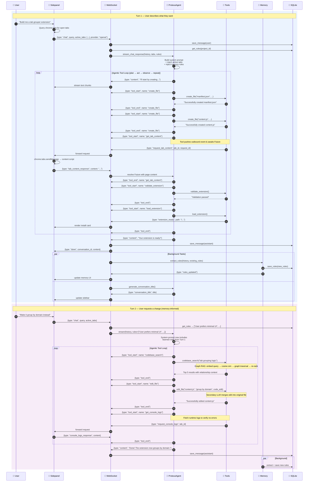
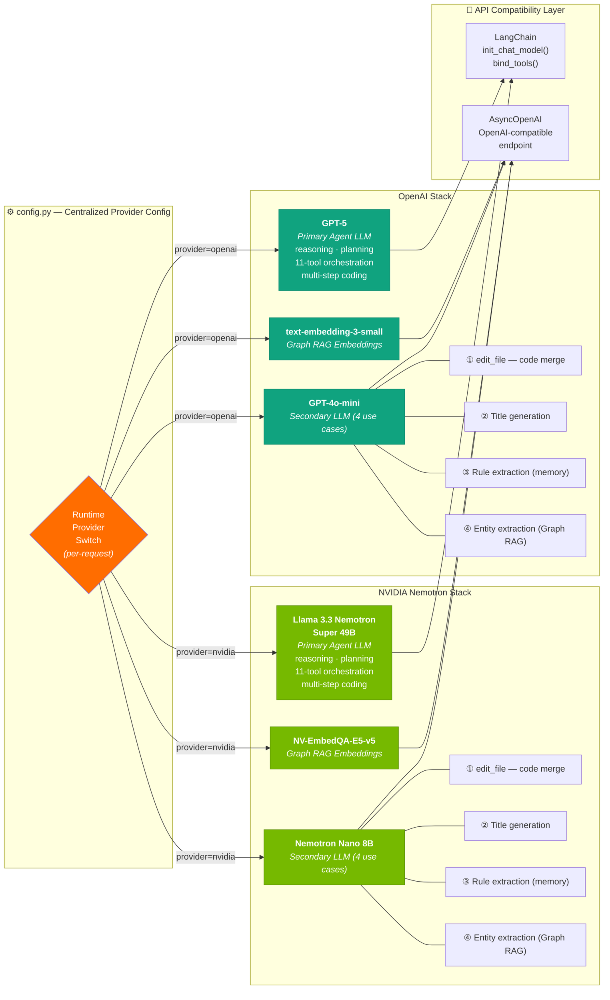
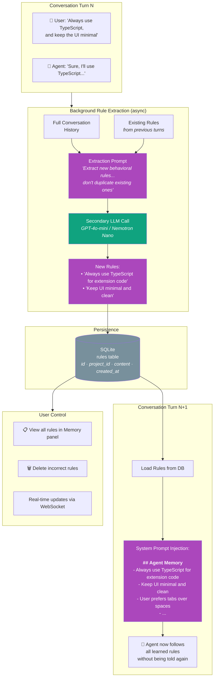
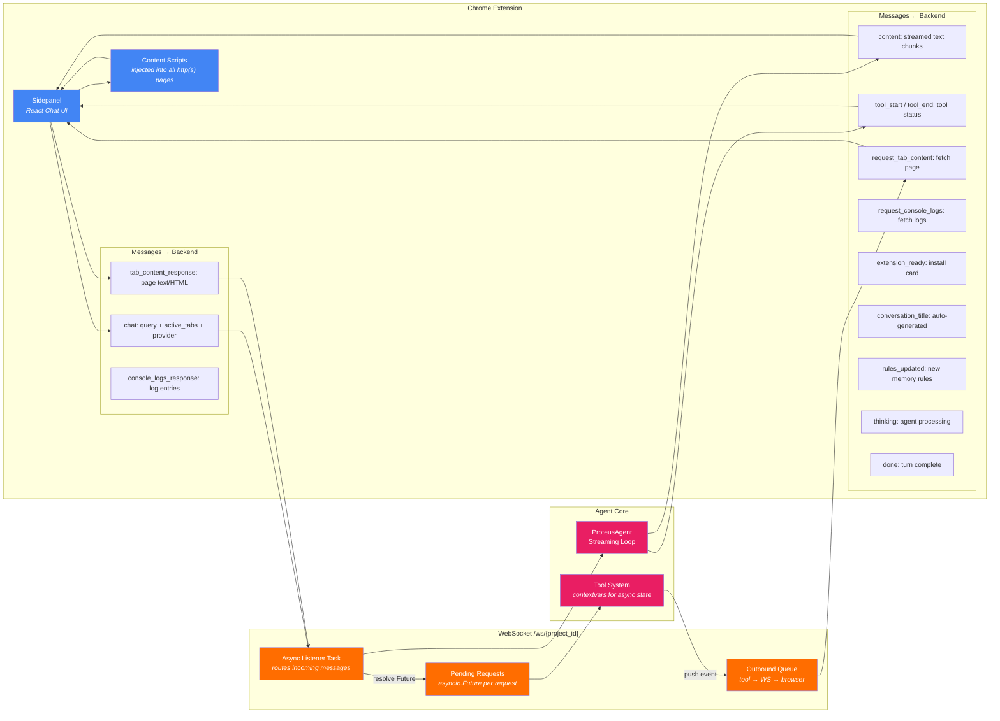

# Proteus Browser — Agent Architecture

> An AI-powered browser that builds its own Chrome extensions. The agent reasons, writes code, searches semantically, reads your tabs, remembers your preferences, and installs extensions — all in a multi-turn conversational loop.

---

## 1. Full System Architecture

```mermaid
flowchart TD
    classDef openai fill:#10a37f,color:#fff,stroke:#0d8c6d
    classDef nvidia fill:#76b900,color:#fff,stroke:#5a8f00
    classDef browser fill:#4285f4,color:#fff,stroke:#3367d6
    classDef tool fill:#ff6d00,color:#fff,stroke:#e65100
    classDef memory fill:#ab47bc,color:#fff,stroke:#8e24aa
    classDef graphrag fill:#00bcd4,color:#fff,stroke:#0097a7
    classDef storage fill:#78909c,color:#fff,stroke:#546e7a
    classDef agent fill:#e91e63,color:#fff,stroke:#c2185b

    %% ─── BROWSER LAYER ───────────────────────────────────────────────
    subgraph CHROME ["🌐 Chrome Browser"]
        direction LR
        SP["Sidepanel Chat UI<br/><i>React + TypeScript</i>"]:::browser
        CS["Content Scripts<br/><i>DOM extraction · console capture</i>"]:::browser
        TABS["Open Browser Tabs<br/><i>tab metadata → agent context</i>"]:::browser
    end

    %% ─── COMMUNICATION ──────────────────────────────────────────────
    SP <-->|"WebSocket<br/>bidirectional JSON"| WS_EP
    CS <-->|"chrome.tabs.sendMessage"| SP

    %% ─── BACKEND ─────────────────────────────────────────────────────
    subgraph BACKEND ["⚙️ FastAPI Backend"]
        direction TB

        WS_EP["/ws/{project_id}<br/><i>WebSocket endpoint</i>"]
        REST["REST API<br/><i>projects · conversations · rules</i>"]

        %% ─── AGENT CORE ─────────────────────────────────────────────
        subgraph AGENT_CORE ["🤖 ProteusAgent — Agentic Loop"]
            direction TB
            ROUTER{"Provider<br/>Router"}:::agent
            PROMPT["System Prompt Builder<br/><i>+ active tabs + memory rules<br/>+ tool availability</i>"]:::agent
            STREAM["Streaming Tool Loop<br/><i>plan → act → observe → repeat</i>"]:::agent

            ROUTER --> PROMPT --> STREAM
        end

        %% ─── DUAL MODEL STACK ────────────────────────────────────────
        subgraph MODELS ["🧠 Dual-Provider Model Stack"]
            direction LR
            subgraph OAI ["OpenAI"]
                GPT5["<b>GPT-5</b><br/>Primary Agent<br/><i>reasoning · planning<br/>tool orchestration</i>"]:::openai
                GPT4OMINI["<b>GPT-4o-mini</b><br/>Secondary<br/><i>code edits · titles<br/>rules · entities</i>"]:::openai
                EMB_OAI["<b>text-embedding-3-small</b><br/>Embeddings"]:::openai
            end
            subgraph NV ["NVIDIA Nemotron"]
                NEM_SUPER["<b>Nemotron Super 49B</b><br/>Primary Agent<br/><i>reasoning · planning<br/>tool orchestration</i>"]:::nvidia
                NEM_NANO["<b>Nemotron Nano 8B</b><br/>Secondary<br/><i>code edits · titles<br/>rules · entities</i>"]:::nvidia
                EMB_NV["<b>NV-EmbedQA-E5-v5</b><br/>Embeddings"]:::nvidia
            end
        end

        ROUTER -->|"openai"| GPT5
        ROUTER -->|"nvidia"| NEM_SUPER

        %% ─── TOOL SYSTEM ────────────────────────────────────────────
        subgraph TOOLS ["🔧 Tool System — 11 Tools"]
            direction TB
            subgraph FS_TOOLS ["Filesystem"]
                LIST["list_dir"]:::tool
                READ["read_file"]:::tool
                GREP["grep_search<br/><i>ripgrep</i>"]:::tool
                CREATE["create_file"]:::tool
                EDIT["edit_file<br/><i>+ secondary LLM apply</i>"]:::tool
            end
            subgraph BROWSER_TOOLS ["Browser Integration"]
                GET_TAB["get_tab_content<br/><i>paginated · cached</i>"]:::tool
                GET_LOGS["get_console_logs<br/><i>filterable · paginated</i>"]:::tool
            end
            subgraph EXT_TOOLS ["Extension Lifecycle"]
                VALIDATE["validate_extension<br/><i>manifest · files · syntax<br/>MV3 compat</i>"]:::tool
                LOAD["load_extension<br/><i>→ install card in UI</i>"]:::tool
            end
            TERM["run_terminal_command<br/><i>sandboxed · bg support</i>"]:::tool
            CSEARCH["codebase_search<br/><i>Graph RAG semantic</i>"]:::tool
        end

        STREAM --> TOOLS

        %% ─── GRAPH RAG ──────────────────────────────────────────────
        subgraph GRAPH_RAG ["🕸️ Graph RAG Engine"]
            direction TB
            subgraph INDEX_PIPE ["Indexing Pipeline"]
                direction LR
                WALK["Walk<br/>Files"] --> CHUNK["Chunk<br/>60-line segments"]
                CHUNK --> ENT_EX["LLM Entity<br/>Extraction"]
                CHUNK --> EMB_CH["Embed<br/>Chunks"]
                ENT_EX --> BUILD_G["Build<br/>NetworkX Graph"]
                EMB_CH --> VEC_STORE["Vector<br/>Store"]
            end
            subgraph SEARCH_PIPE ["Search Pipeline"]
                direction LR
                EMB_Q["Embed<br/>Query"] --> COS["Cosine<br/>Similarity"]
                COS --> TOP_K["Top-K<br/>Vector Hits"]
                TOP_K --> GRAPH_EXP["Graph<br/>Traversal<br/>1-2 hops"]
                GRAPH_EXP --> RERANK["Re-rank<br/><i>0.75·vec + 0.25·graph</i>"]
            end
            KG[("Knowledge Graph<br/><i>files · functions · classes<br/>IMPORTS · CALLS · EXPORTS<br/>EXTENDS · USES</i>")]:::graphrag
        end

        CSEARCH --> SEARCH_PIPE
        BUILD_G --> KG
        GRAPH_EXP --> KG
        ENT_EX -.->|"secondary LLM"| GPT4OMINI
        ENT_EX -.->|"secondary LLM"| NEM_NANO
        EMB_CH -.-> EMB_OAI
        EMB_CH -.-> EMB_NV
        EMB_Q -.-> EMB_OAI
        EMB_Q -.-> EMB_NV

        %% ─── MEMORY SYSTEM ──────────────────────────────────────────
        subgraph MEMORY ["🧠 Agent Memory System"]
            direction LR
            RULE_EX["Rule Extractor<br/><i>post-turn background task</i>"]:::memory
            RULE_DB["Per-Project Rules<br/><i>preferences · corrections<br/>style · constraints</i>"]:::memory
            RULE_INJ["Rule Injection<br/><i>→ system prompt</i>"]:::memory
            RULE_EX --> RULE_DB --> RULE_INJ
        end

        RULE_EX -.->|"secondary LLM"| GPT4OMINI
        RULE_EX -.->|"secondary LLM"| NEM_NANO
        RULE_INJ --> PROMPT

        %% ─── STORAGE ────────────────────────────────────────────────
        DB[("SQLite<br/><i>projects · conversations<br/>messages · rules</i>")]:::storage
        FS[("demo_code/{project}/<br/><i>generated extension files</i>")]:::storage
    end

    %% ─── CROSS-LAYER CONNECTIONS ────────────────────────────────────
    WS_EP --> AGENT_CORE
    REST --> DB
    WS_EP <--> DB

    GET_TAB -->|"request_tab_content<br/>via outbound queue"| WS_EP
    GET_LOGS -->|"request_console_logs<br/>via outbound queue"| WS_EP
    LOAD -->|"extension_ready<br/>via outbound queue"| WS_EP

    EDIT -.->|"secondary LLM"| GPT4OMINI
    EDIT -.->|"secondary LLM"| NEM_NANO

    FS_TOOLS --> FS
    TERM --> FS
    INDEX_PIPE -.-> FS

    TABS --> SP
    WS_EP -->|"request_tab_content"| SP
    SP -->|"tab_content_response"| WS_EP
```



---

## 2. Multi-Turn Conversational Agent Flow

> *Targeting: Decagon / Greylock / Google — Best Multi-Turn Conversational Agent*



---

## 3. Graph RAG — Knowledge Graph Search Engine

> *Semantic code search that understands code structure, not just text matching*

```mermaid
flowchart TB
    classDef llm fill:#10a37f,color:#fff
    classDef embed fill:#00bcd4,color:#fff
    classDef graph fill:#ff6d00,color:#fff
    classDef data fill:#78909c,color:#fff

    subgraph INDEXING ["📦 Indexing Pipeline (triggered on first search per project)"]
        direction TB

        FILES["📁 Walk Project Files<br/><i>skip: node_modules, .git, binaries<br/>index: .js .ts .py .html .css .json ...</i>"]:::data

        FILES --> CHUNK["✂️ Chunk into 60-line Segments<br/><i>10-line overlap between chunks</i>"]

        CHUNK --> LLM_EX["🤖 LLM Entity Extraction<br/><i>one call per file</i><br/><br/>Extract:<br/>• functions, classes, components<br/>• imports, calls, exports, extends"]:::llm
        
        CHUNK --> EMBED["🔢 Embed Chunks<br/><i>batch of 100</i>"]:::embed

        LLM_EX --> GRAPH_BUILD["🕸️ Build Knowledge Graph<br/><i>NetworkX DiGraph</i>"]:::graphrag

        GRAPH_BUILD --> NODES["<b>Nodes:</b><br/>• file:path<br/>• chunk:path:lines<br/>• entity:path:name<br/>• ref:module"]
        GRAPH_BUILD --> EDGES["<b>Edges:</b><br/>• CONTAINS (file → chunk)<br/>• DEFINES (file → entity)<br/>• IMPORTS (file → file/module)<br/>• CALLS (func → func)<br/>• EXPORTS (file → symbol)<br/>• EXTENDS (class → class)<br/>• USES (func → variable)"]

        EMBED --> MATRIX["📊 Embedding Matrix<br/><i>n_chunks × 1536 dims</i>"]:::data
    end

    subgraph SEARCH ["🔍 Search Pipeline (per query)"]
        direction TB

        QUERY["❓ Natural Language Query<br/><i>'handle user click on tab group'</i>"]

        QUERY --> EMB_Q["🔢 Embed Query"]:::embed
        EMB_Q --> COSINE["📐 Cosine Similarity<br/><i>query vec × embedding matrix</i>"]
        COSINE --> TOP10["🏆 Top 10 Vector Hits"]

        TOP10 --> GRAPH_WALK["🚶 Graph Traversal<br/><i>BFS 1-2 hops from each hit's file node<br/>undirected view</i>"]:::graphrag

        GRAPH_WALK --> BONUS["📈 Graph Proximity Bonus<br/><i>bonus = hit_score × 1/(1+distance)</i>"]

        BONUS --> COMBINE["⚖️ Combined Score<br/><i>final = vec_score + 0.25 × graph_bonus</i>"]

        COMBINE --> RESULTS["📋 Top 5 Results<br/><i>file:lines + code + entities + relationships</i>"]
    end

    MATRIX --> COSINE
    NODES --> GRAPH_WALK
    EDGES --> GRAPH_WALK

    subgraph CACHE ["♻️ Intelligent Caching"]
        FP["File fingerprint (MD5 of paths + mtimes)"]
        HIT["Cache hit → skip rebuild"]
        MISS["Cache miss → background rebuild"]
    end
```

---

## 4. Dual-Provider Model Architecture

> *Targeting: OpenAI — Best Use of OpenAI API + NVIDIA — Best Use of NVIDIA Open Models*



---

## 5. Agent Memory — Learning Across Conversations

> *Targeting: Best Multi-Turn Conversational Agent*



---

## 6. Browser Integration — Bidirectional WebSocket



---

## 7. Extension Development Lifecycle

```mermaid
flowchart TD
    classDef agent fill:#e91e63,color:#fff
    classDef tool fill:#ff6d00,color:#fff
    classDef check fill:#4caf50,color:#fff
    classDef user fill:#4285f4,color:#fff

    START["👤 User: 'Build me a dark mode toggler extension'"]:::user

    START --> PLAN["🤖 Agent plans the extension<br/><i>manifest.json · content scripts<br/>popup · service worker</i>"]:::agent

    PLAN --> TAB_READ["🔧 get_tab_content<br/><i>Read user's active tab to understand<br/>the target site's DOM structure</i>"]:::tool

    TAB_READ --> CODE_GEN

    subgraph CODE_GEN ["Code Generation Loop"]
        direction TB
        CF1["🔧 create_file manifest.json"]:::tool
        CF2["🔧 create_file content.js"]:::tool
        CF3["🔧 create_file popup.html"]:::tool
        CF4["🔧 create_file styles.css"]:::tool
        CF1 --> CF2 --> CF3 --> CF4
    end

    CODE_GEN --> VALIDATE_1["🔧 validate_extension<br/><i>4-layer validation:<br/>① manifest fields<br/>② file references<br/>③ JS syntax (node --check)<br/>④ MV3 compatibility</i>"]:::check

    VALIDATE_1 -->|"errors found"| FIX

    subgraph FIX ["Iterative Fix Loop"]
        direction TB
        SEARCH["🔧 codebase_search / grep_search<br/><i>find the problematic code</i>"]:::tool
        EDIT_FIX["🔧 edit_file<br/><i>secondary LLM applies fix</i>"]:::tool
        READ_CHK["🔧 read_file<br/><i>verify the fix</i>"]:::tool
        SEARCH --> EDIT_FIX --> READ_CHK
    end

    FIX --> VALIDATE_2["🔧 validate_extension"]:::check
    VALIDATE_1 -->|"passed ✓"| INSTALL
    VALIDATE_2 -->|"passed ✓"| INSTALL

    INSTALL["🔧 load_extension<br/><i>sends extension_ready event<br/>via WebSocket to sidepanel</i>"]:::tool

    INSTALL --> CARD["📱 Install Card in Chat<br/><i>• Load Extension button (auto)<br/>• Copy Path (manual fallback)<br/>• Open chrome://extensions</i>"]:::user

    CARD --> TEST["👤 User tests extension"]:::user
    TEST -->|"'It's not working on YouTube'"| DEBUG

    subgraph DEBUG ["Debug Loop"]
        direction TB
        LOGS["🔧 get_console_logs<br/><i>fetch runtime errors</i>"]:::tool
        TAB2["🔧 get_tab_content<br/><i>inspect current DOM state</i>"]:::tool
        CS2["🔧 codebase_search<br/><i>find related code via Graph RAG</i>"]:::tool
        EDIT2["🔧 edit_file<br/><i>apply the fix</i>"]:::tool
        LOGS --> TAB2 --> CS2 --> EDIT2
    end

    DEBUG --> VALIDATE_3["🔧 validate_extension"]:::check
    VALIDATE_3 -->|"passed ✓"| RELOAD["🔧 load_extension<br/><i>user reloads extension</i>"]:::tool
    RELOAD --> DONE["✅ Extension working!"]:::check
```



---

## Key Technical Highlights

| Feature | Implementation | Prize Relevance |
|---------|---------------|-----------------|
| **Multi-model orchestration** | GPT-5 primary + GPT-4o-mini secondary (4 use cases) + embeddings | OpenAI |
| **Full NVIDIA stack** | Nemotron Super 49B + Nano 8B + NV-EmbedQA-E5 — zero OpenAI deps | NVIDIA |
| **Runtime provider switching** | Centralized config.py, per-request contextvars | OpenAI + NVIDIA |
| **Graph RAG search** | NetworkX knowledge graph + vector embeddings + BFS traversal | All |
| **Agent memory** | Background rule extraction → SQLite → system prompt injection | Conversational |
| **11-tool agentic loop** | Plan → Act → Observe → Repeat with streaming | All |
| **Bidirectional WebSocket** | Agent can request data FROM the browser mid-turn | Conversational |
| **Tab awareness** | Active tabs in system prompt, on-demand DOM/HTML fetching | Conversational |
| **Console log access** | Runtime debugging without leaving the chat | Conversational |
| **Extension lifecycle** | Code → Validate (4 layers) → Install → Debug → Iterate | All |
| **Streaming UX** | Real-time tool status, text streaming, async background tasks | All |
